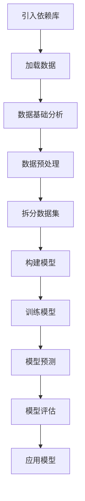

# 逻辑回归流程步骤总结

1. **引入依赖库**
   - 导入pandas、numpy、matplotlib、seaborn等常用数据分析和可视化库。
   - 导入sklearn中的模型、数据集、数据拆分、评估等相关模块。

2. **加载数据**
   - 通过`sklearn.datasets`加载乳腺癌数据集。
   - 用pandas将数据集转换为DataFrame格式，便于后续分析。

3. **数据基础分析**
   - 使用`info()`、`describe()`等方法查看数据的基本信息和统计特征。
   - 检查数据是否有缺失值或异常值。

4. **数据预处理**
   - （本例数据无需特殊处理，若有缺失值、异常值、特征归一化等需求需在此步骤处理）

5. **拆分数据集**
   - 使用`train_test_split`将数据集划分为训练集和测试集，常用比例为7:3。

6. **构建模型**
   - 实例化逻辑回归模型（本例用的是线性回归，实际分类问题应使用`LogisticRegression`）。

7. **训练模型**
   - 用训练集数据`fit`模型，学习特征与标签之间的关系。

8. **模型预测**
   - 用测试集数据进行预测，得到预测结果。

9. **模型评估**
   - 计算均方误差（MSE）、均方根误差（RMSE）等指标，评估模型性能。
   - 查看模型的系数、截距和准确率等。

10. **应用模型**
    - 使用训练好的模型对新样本进行预测，判断其分类结果。

---

> 实际项目中，数据预处理和特征工程往往是最耗时且最关键的部分，包括缺失值处理、异常值检测、特征选择、特征缩放等。
> 逻辑回归适用于二分类问题，输出为概率值，常用sigmoid函数将线性输出映射到0-1区间。 

---

## 逻辑回归流程图

